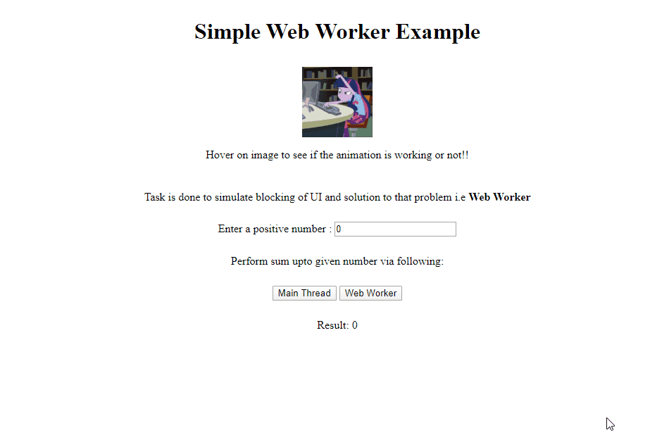

# Simple Web Worker Example
This is done to simulate the problem of UI blocking due to heavy process on main thread and solve to the issue via "Web Worker".

## Important note
Web worker won't work if you try to serve the `index.html` via locally from file onto browser.

It's better to install `http-server` and serve your file.

## Step to install
Just install `http-server` globally using via `npm` command:

    npm install -g http-server

Then go the location where your html file is stored and run command:
    
    http-server

## For Example: 
Your html file is stored in `./simple-web-worker-example/index.html` 
then you can do following:

    ~$ cd /simple-web-worker-example/index.html 
    
    ~$ http-server

# Demo
